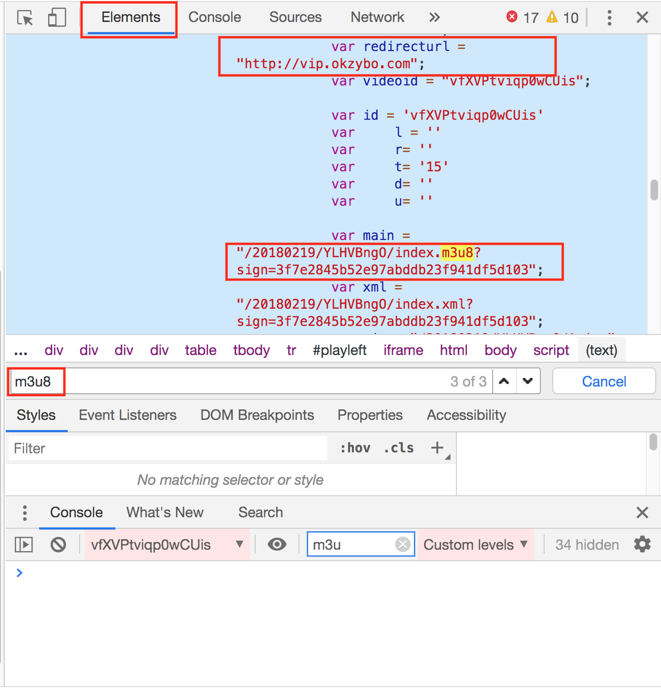

### Teach You to Find `M3U8` Manually

Take this page for example, just for study

<https://sounm.com/index.php/vod/play/id/14585/sid/1/nid/1.html>

then download real `TS` and convert all of them into single `MP4` file

#### Detailed Steps to Find Out `M3U8` Contained Slices

##### Get first url
use regex pattern or just search in the index.html

<div align=center></div>

combine `redirecturl` and `main` we get first url


    https://vip.okokbo.com/20180219/YLHVBngO/index.m3u8?sign=3f7e2845b52e97abddb23f941df5d103%22
    
    # that is actually
    https://vip.okokbo.com/20180219/YLHVBngO/index.m3u8

##### Get second url

parse <https://vip.okokbo.com/20180219/YLHVBngO/index.m3u8>, here is its content

```
#EXTM3U
#EXT-X-STREAM-INF:PROGRAM-ID=1,BANDWIDTH=1000000,RESOLUTION=1080x608
1000kb/hls/index.m3u8
```

we get a second url

    https://vip.okokbo.com/20180219/YLHVBngO/1000kb/hls/index.m3u8
    
##### Get real TS list

open <https://vip.okokbo.com/20180219/YLHVBngO/1000kb/hls/index.m3u8>

```
#EXTM3U
#EXT-X-VERSION:3
#EXT-X-TARGETDURATION:8
#EXT-X-MEDIA-SEQUENCE:0
#EXTINF:4.000000,
kvdlgnXh2652000.ts
#EXTINF:4.640000,
kvdlgnXh2652001.ts
#EXTINF:4.000000,
kvdlgnXh2652002.ts
... ...

#EXTINF:0.720000,
kvdlgnXh26521312.ts
#EXTINF:4.000000,
kvdlgnXh26521313.ts
#EXTINF:5.360000,
kvdlgnXh26521314.ts
#EXTINF:0.080000,
kvdlgnXh26521315.ts
#EXT-X-ENDLIST
```

from No.2652000 to 26521315, which contains **1316** TS slices in total

##### Download each TS slice

use the first `m3u8` url we get as input parameter is ok for `ffmpeg`

```bash
ffmpeg -i https://vip.okokbo.com/20180219/YLHVBngO/index.m3u8 -c copy -bsf:a aac_adtstoasc output.mp4
```

##### Output Demo
single command using `ffmpeg`, with single thread which needs to be updated

```
$ ffmpeg -i https://vip.okokbo.com/20180219/YLHVBngO/index.m3u8 -c copy -bsf:a aac_adtstoasc output.mp4
ffmpeg version 4.1.3 Copyright (c) 2000-2019 the FFmpeg developers
  built with Apple LLVM version 10.0.0 (clang-1000.11.45.5)
  configuration: --prefix=/usr/local/Cellar/ffmpeg/4.1.3_1 --enable-shared --enable-pthreads --enable-version3 --enable-hardcoded-tables --enable-avresample --cc=clang --host-cflags='-I/Library/Java/JavaVirtualMachines/adoptopenjdk-11.0.2.jdk/Contents/Home/include -I/Library/Java/JavaVirtualMachines/adoptopenjdk-11.0.2.jdk/Contents/Home/include/darwin' --host-ldflags= --enable-ffplay --enable-gnutls --enable-gpl --enable-libaom --enable-libbluray --enable-libmp3lame --enable-libopus --enable-librubberband --enable-libsnappy --enable-libtesseract --enable-libtheora --enable-libvorbis --enable-libvpx --enable-libx264 --enable-libx265 --enable-libxvid --enable-lzma --enable-libfontconfig --enable-libfreetype --enable-frei0r --enable-libass --enable-libopencore-amrnb --enable-libopencore-amrwb --enable-libopenjpeg --enable-librtmp --enable-libspeex --enable-videotoolbox --disable-libjack --disable-indev=jack --enable-libaom --enable-libsoxr
  libavutil      56. 22.100 / 56. 22.100
  libavcodec     58. 35.100 / 58. 35.100
  libavformat    58. 20.100 / 58. 20.100
  libavdevice    58.  5.100 / 58.  5.100
  libavfilter     7. 40.101 /  7. 40.101
  libavresample   4.  0.  0 /  4.  0.  0
  libswscale      5.  3.100 /  5.  3.100
  libswresample   3.  3.100 /  3.  3.100
  libpostproc    55.  3.100 / 55.  3.100
[hls,applehttp @ 0x7fe69600b000] Opening 'https://vip.okokbo.com/20180219/YLHVBngO/1000kb/hls/index.m3u8' for reading
[hls,applehttp @ 0x7fe69600b000] Opening 'https://vip.okokbo.com/20180219/YLHVBngO/1000kb/hls/kvdlgnXh2652000.ts' for reading
[hls,applehttp @ 0x7fe69600b000] Opening 'https://vip.okokbo.com/20180219/YLHVBngO/1000kb/hls/kvdlgnXh2652001.ts' for reading
Input #0, hls,applehttp, from 'https://vip.okokbo.com/20180219/YLHVBngO/index.m3u8':
  Duration: 01:27:39.52, start: 1.457000, bitrate: N/A
  Program 0
    Metadata:
      variant_bitrate : 1000000
    Stream #0:0: Video: h264 (High) ([27][0][0][0] / 0x001B), yuv420p, 1080x608, 25 fps, 25 tbr, 90k tbn, 50 tbc
    Metadata:
      variant_bitrate : 1000000
    Stream #0:1: Audio: aac (LC) ([15][0][0][0] / 0x000F), 44100 Hz, stereo, fltp
    Metadata:
      variant_bitrate : 1000000
Output #0, mp4, to 'output.mp4':
  Metadata:
    encoder         : Lavf58.20.100
    Stream #0:0: Video: h264 (High) (avc1 / 0x31637661), yuv420p, 1080x608, q=2-31, 25 fps, 25 tbr, 90k tbn, 90k tbc
    Metadata:
      variant_bitrate : 1000000
    Stream #0:1: Audio: aac (LC) (mp4a / 0x6134706D), 44100 Hz, stereo, fltp
    Metadata:
      variant_bitrate : 1000000
Stream mapping:
  Stream #0:0 -> #0:0 (copy)
  Stream #0:1 -> #0:1 (copy)
Press [q] to stop, [?] for help
[https @ 0x7fe695811000] Opening 'https://vip.okokbo.com/20180219/YLHVBngO/1000kb/hls/kvdlgnXh2652002.ts' for reading
[https @ 0x7fe69606ae00] Opening 'https://vip.okokbo.com/20180219/YLHVBngO/1000kb/hls/kvdlgnXh2652003.ts' for reading
[https @ 0x7fe695811000] Opening 'https://vip.okokbo.com/20180219/YLHVBngO/1000kb/hls/kvdlgnXh2652004.ts' for reading
[https @ 0x7fe69606ae00] Opening 'https://vip.okokbo.com/20180219/YLHVBngO/1000kb/hls/kvdlgnXh2652005.ts' for reading
[https @ 0x7fe695811000] Opening 'https://vip.okokbo.com/20180219/YLHVBngO/1000kb/hls/kvdlgnXh2652006.ts' for reading
[https @ 0x7fe69606ae00] Opening 'https://vip.okokbo.com/20180219/YLHVBngO/1000kb/hls/kvdlgnXh2652007.ts' for reading
[https @ 0x7fe695811000] Opening 'https://vip.okokbo.com/20180219/YLHVBngO/1000kb/hls/kvdlgnXh2652008.ts' for reading
[https @ 0x7fe69606ae00] Opening 'https://vip.okokbo.com/20180219/YLHVBngO/1000kb/hls/kvdlgnXh2652009.ts' for reading
[https @ 0x7fe695811000] Opening 'https://vip.okokbo.com/20180219/YLHVBngO/1000kb/hls/kvdlgnXh2652010.ts' for reading
... ...
```